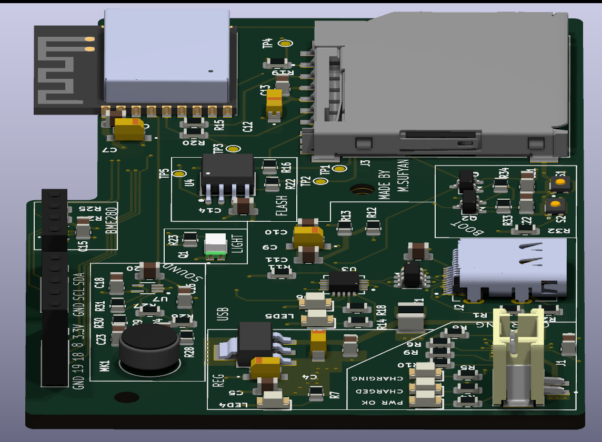
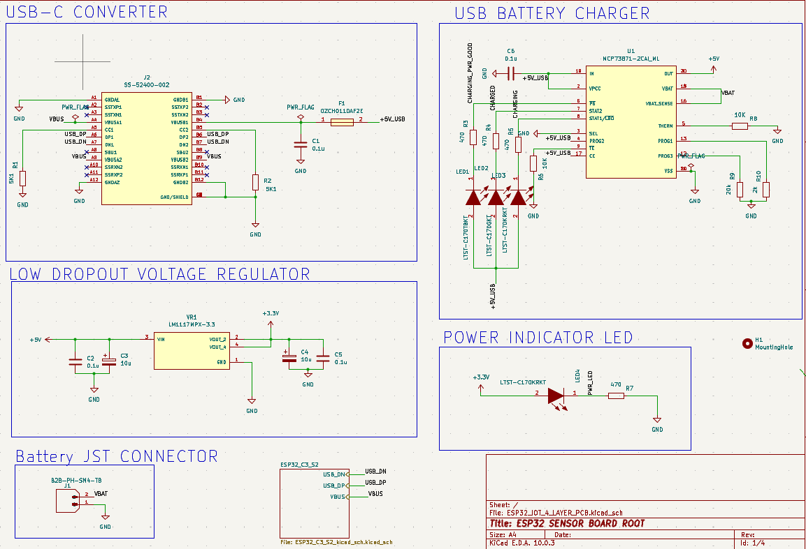
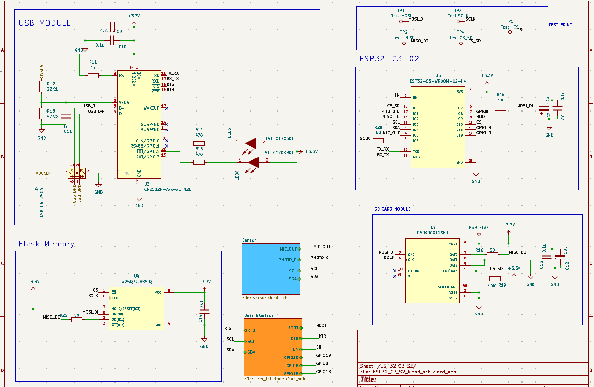
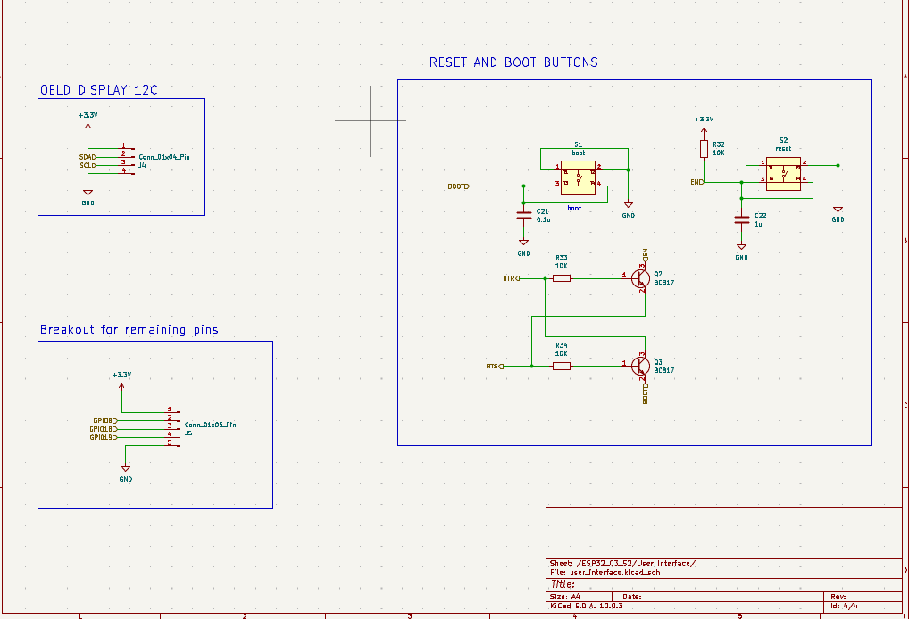
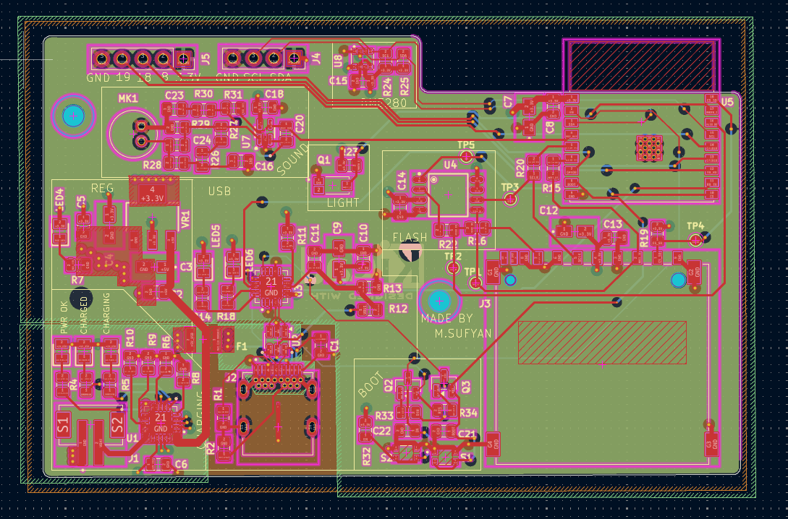
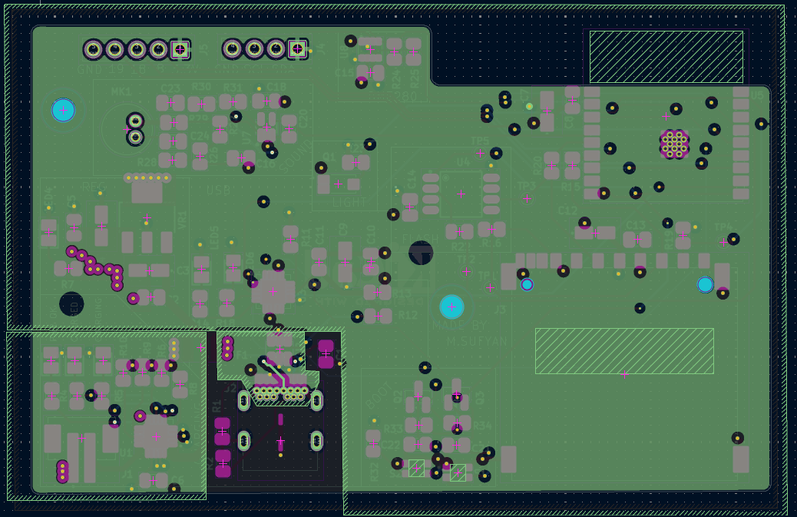
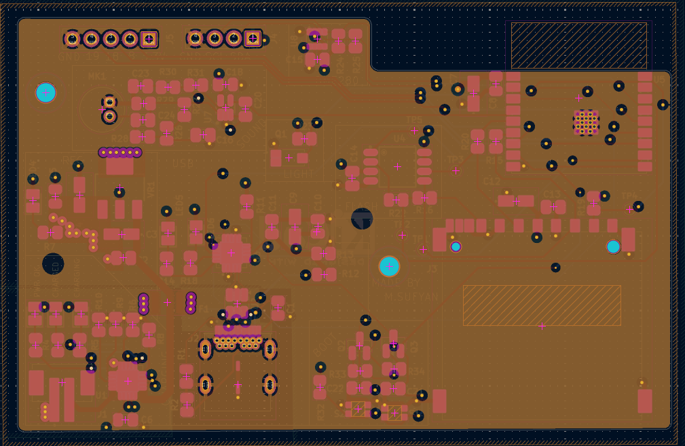
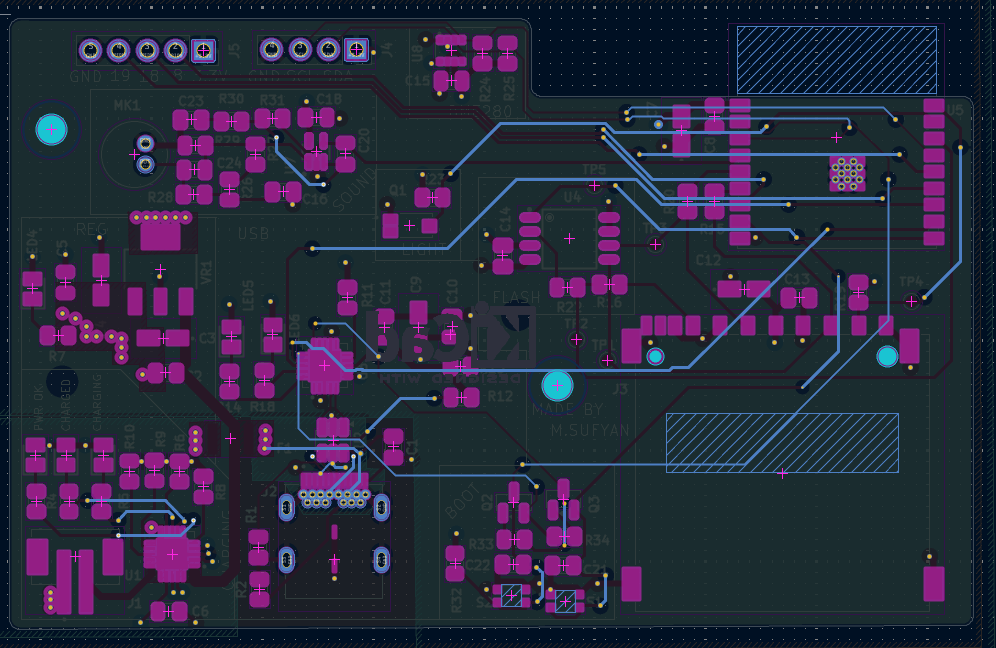
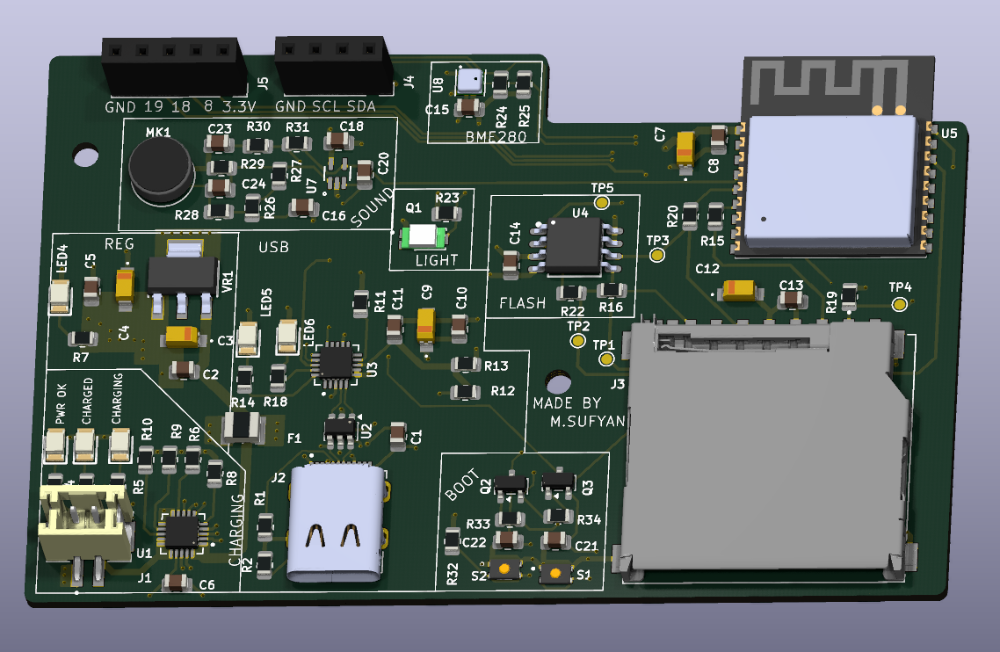
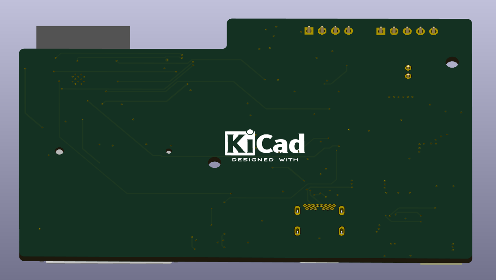

# Custom ESP32-C3 IoT Sensor Board

A professional, high-reliability 4-layer IoT edge platform designed end-to-end in KiCad. This board consolidates multi-sensor environmental telemetry, secure local storage, and intelligent Li-ion battery management around a RISC-V core.

  

---

## Technical Overview

The **ESP32-C3 IoT Sensor Board** is an ultra-compact, production-grade hardware platform built around the **ESP32-C3-WROOM-02** module. Designed to bridge the gap between benchtop breadboard prototypes and ruggedized field deployments, it integrates multi-domain sensing (atmospheric, acoustic, and luminous), redundant high-speed local storage, and a robust power management front-end onto a tightly constrained 4-layer stack-up.

### Subsystem Architecture

The board is architected with modular robustness in mind. Rather than relying on generic breakouts, every component is integrated directly onto the PCB, adhering to proper impedance matching, signal decoupling, and low-noise analog routing guidelines.

| Subsystem | Silicon / Component | Technical Specifications & Role |
| :--- | :--- | :--- |
| **MCU & Radio** | ESP32-C3-WROOM-02-H4 | 32-bit RISC-V single-core processor @ 160 MHz, integrated 2.4 GHz Wi-Fi & BLE 5.0 |
| **USB-UART Bridge**| CP2102N-A02-GQFN20 | High-speed data transit up to 3 Mbps; hardware flow control for automated flashing |
| **Power Path / Charger** | NCP73871-2CAI/WL | Linear Li-ion charge management with programmable thermal regulation & status pins |
| **LDO Regulator** | LML1117MPX-3.3 | High-efficiency 5 V to 3.3 V LDO supplying up to 800 mA to critical RF & sensor rails |
| **Atmospheric Sensing** | BME280 | Ultra-low power digital sensor for temperature, relative humidity, and barometric pressure |
| **Luminous Sensing** | TEMT6000X01 | Silicon NPN phototransistor matching human eye spectral sensitivity for ambient light sensing |
| **Acoustic Sensing** | MAX4466EXK + Mic | Electret condenser microphone paired with a rail-to-rail op-amp boasting adjustable gain |
| **Onboard Storage** | W25Q32JVSSIQ | 32 Mbit SPI NOR Flash dedicated to structured logging, failsafe firmware, or local databases |
| **Removable Storage** | microSD Socket | SPI-driven MicroSD card slot for bulk data logging and local diagnostic storage |

---

## Schematic Design

The electrical schematics are strategically partitioned across four clean, highly readable sheets. This modular organization ensures that power domains, high-frequency digital buses, and sensitive analog signals are isolated systematically.

* **Power & Root Management:** Incorporates a robust ESD-protected USB-C interface, the NCP73871 battery charger with charge/standby visual indicators, a dedicated Li-ion JST terminal, and a thermal-regulation-backed LDO stage delivering a clean 3.3V rail.
* **Core Processing & Storage:** Centers around the ESP32-C3 module, complete with vital decoupling networks, standard strapping resistor configurations, the CP2102N UART bridge, and dual SPI storage options (NOR flash and microSD).
* **Analog & Digital Sensors:** Interfaces the digital BME280 over an optimized I2C bus alongside the TEMT6000 light-intensity circuit and the high-gain MAX4466 microphone pre-amplifier network.
* **User Interface & Diagnostics:** Houses a dedicated I2C OLED display breakout, physical user tactile inputs (Boot & Reset), a GPIO expansion rail, and the standard dual-transistor auto-program/reset circuitry.

---

## PCB Stack-Up & Layout Philosophy

Designing an RF-enabled IoT board requires strict attention to electromagnetic compatibility (EMC) and signal integrity. A **4-layer PCB stack-up** was selected to achieve a continuous, unbroken reference ground plane directly beneath high-speed signals, mitigating crosstalk and RF return-path issues.

### Layout Highlights
* **RF Optimization:** The ESP32-C3’s onboard PCB antenna is positioned over a complete copper keep-out zone extending through all four layers of the board edge to maximize wireless transmission efficiency and range.
* **Signal Isolation:** Sensitive analog trace runs from the MAX4466 microphone amplifier are physically isolated from high-speed digital SPI lines and shielded by localized ground pours to prevent digital switching noise coupling into the audio stream.
* **Power Distribution Network (PDN):** Star-routing configurations and low-ESR ceramic decoupling capacitors located immediately adjacent to IC power pins ensure a highly stable power delivery network, dampening transient spikes during RF transmission bursts.

<table>
  <tr>
    <td align="center"> <b>Layer 1: Front Copper (RF, Signals & High-Current Traces)</b></td>
    <td align="center"> <b>Layer 2: Inner Ground (Solid Reference Plane)</b></td>
  </tr>
  <tr>
    <td align="center"> <b>Layer 3: Inner Power (Split VCC_3V3 & VBUS Planes)</b></td>
    <td align="center"> <b>Layer 4: Back Copper (Secondary Signal Routing)</b></td>
  </tr>
</table>

---

## Mechanical & 3D Verification

3D modeling was executed concurrently with routing inside KiCad's mechanical viewer. This physical validation ensured precise vertical clearance profiles for all discrete components, verified JST battery plug and USB-C port accessibility, and guaranteed seamless physical integration with custom-designed 3D-printed or injection-molded enclosures.

<table>
  <tr>
    <td align="center"> <b>Front Orthographic Assembly</b></td>
    <td align="center"> <b>Back Orthographic Assembly</b></td>
  </tr>
</table>

  

*Perspective render showcasing mechanical profile heights, component density, and silkscreen alignment.*

---

## Pinout and Connector Interfaces

### J4 — External OLED Header (I2C)
Provides a direct plug-and-play interface for small-form-factor I2C display panels (e.g., SSD1306) to show local telemetry in real time.

| Pin | Physical Designation | Signal Line | Description |
| :---: | :---: | :---: | :--- |
| **1** | GND | Ground | Main system ground reference |
| **2** | SCL | GPIO9 / SCL | I2C Serial Clock (10k pull-up onboard) |
| **3** | SDA | GPIO8 / SDA | I2C Serial Data (10k pull-up onboard) |
| **4** | 3.3V | VCC_3V3 | Cleaned 3.3V system power rail |

### J5 — GPIO Expansion Port
A secondary breakout header designed for system expansion, enabling the integration of external actuator modules, relay controls, or extra sensors.

| Pin | Physical Designation | Signal Line | Description |
| :---: | :---: | :---: | :--- |
| **1** | GND | Ground | Main system ground reference |
| **2** | IO19 | GPIO19 | General-purpose digital Input/Output |
| **3** | IO18 | GPIO18 | General-purpose digital Input/Output |
| **4** | IO8 | GPIO8 | General-purpose digital Input/Output |
| **5** | 3.3V | VCC_3V3 | Cleaned 3.3V system power rail |

### High-Speed SPI Diagnostics Test Points
Dedicated copper test pads are located on the PCB surface for logic analyzer debugging of the high-speed shared SPI bus. These permit painless monitoring of communication traffic between the MCU, the flash storage chip, and the microSD card.

| Test Point | Signal | Target Subsystem |
| :---: | :---: | :---: |
| **TP1** | MOSI | Master Out Slave In (Shared Bus) |
| **TP2** | MISO | Master In Slave Out (Shared Bus) |
| **TP3** | SCLK | Serial Clock (Shared Bus) |
| **TP4** | CS_SD | Chip Select (microSD Card) |
| **TP5** | CS_FL | Chip Select (NOR Flash) |

---

## Design and Operational Features

* **Auto-Program/Auto-Reset Circuitry:** Dual NPN-transistor auto-flashing logic allows seamless firmware uploads directly from any modern IDE (such as PlatformIO or the Arduino IDE) with a single click. There is no need to perform awkward button presses on the physical unit during flash compile sequences.
* **Bus Arbitration Resilience:** The SPI storage architecture uses dedicated, decoupled Chip Select lines (`CS_SD` and `CS_FL`) allowing the firmware to securely coordinate and multiplex operations between high-capacity, slow microSD card filesystem writes and fast, structured onboard NOR flash database logs.
* **Low-Noise Ground Isolation:** Features specialized split ground planes with a single-point bridge connection (star ground topology) to prevent switching transient noise generated by the ESP32-C3 radio from corrupting the highly sensitive analog input signal of the microphone op-amp stage.

---

## Applications

* **Localized Microclimate Monitoring:** Secure logging of humidity, barometric pressure, and temperature variations over long time horizons.
* **Industrial Noise & Light Level Logging:** Real-time logging of acoustic noise thresholds and lighting conditions for factory floor safety and auditing.
* **Field Prototyping Platform:** A robust, reliable alternative to unstable breadboard and jumper-wire setups for rapid IoT firmware validation under realistic battery-powered situations.

---

## Author

Designed and maintained by:

**Muhammad Sufyan** Electrical Engineering Department  
*Pakistan Institute of Engineering and Applied Sciences (PIEAS)* [LinkedIn](#) · [GitHub](#)
